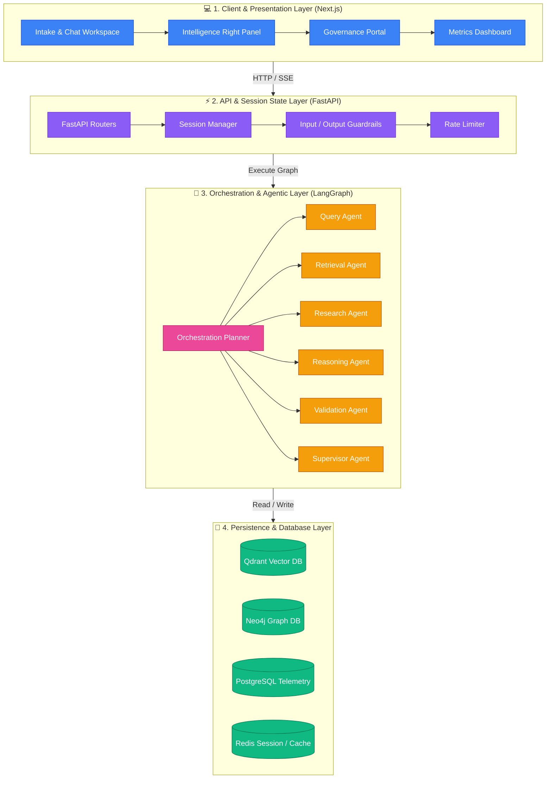
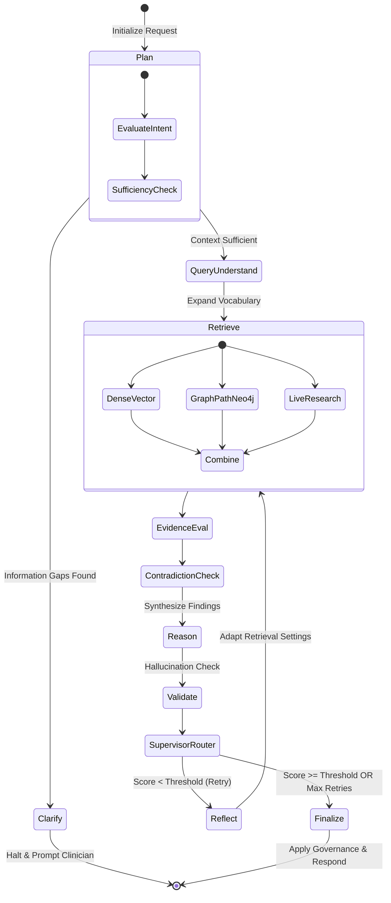

# ⚕️ Aegis Clinical Intelligence System
### *Conversational Adaptive Multi-Agent Clinical Intelligence Platform — Phase 13*

[](https://opensource.org/licenses/MIT)
[](https://fastapi.tiangolo.com)
[](https://nextjs.org)
[](https://github.com/langchain-ai/langgraph)
[](https://www.python.org)

**Aegis** is an advanced, production-hardened clinical reasoning and intelligence platform. It coordinates specialized AI agents using a dynamic, planning-centric workflow built on **LangGraph**. Designed to serve as a physician’s decision-support copilot, Aegis safely processes patient presentations by executing structured vector retrieval (Qdrant), knowledge-graph entity tracing (Neo4j), live internet clinical research (PubMed/Semantic Scholar), multimodal clinical image/report analysis (ECG, Radiology, OCR), and clinician clarification loops—all wrapped in a strict clinical safety guardrail and human-in-the-loop governance infrastructure.

---

## 🏛️ Layered System Architecture

Aegis is constructed using a clean, decoupling-oriented layered architecture to ensure isolation of concerns, high throughput, and strict clinical governance:



### 1. Client & Presentation Layer (Frontend)
Built with **Next.js (App Router)** and **TypeScript**. Highlights:
*   **Intake & Conversational Workspace**: A rich, responsive UI utilizing **Framer Motion** and **TailwindCSS** to perform conversational intake, upload clinical documents, and display structured outputs.
*   **Intelligence Panel**: Powered by **Zustand** and **@xyflow/react**, this sidebar visualizes the active execution plan, source evaluation scores, detected contradictions, and clinical gaps.
*   **Governance Hub**: A dedicated interface for medical reviewers to approve, reject, or override responses held for clinical safety reasons.

### 2. API & Session State Layer (FastAPI)
The backend hub that manages requests and endpoints:
*   **FastAPI Engine**: Serves low-latency REST and Server-Sent Event (SSE) streaming endpoints.
*   **Conversational Sessions**: The `ConversationalPatientSession` tracks multi-turn patient contexts (vitals, history, medications) across dialog turns, using **Redis** for state caching.
*   **Rate Limiting & Authentication**: Protected via JWT tokens (`python-jose`) and endpoint rate-limiting (`slowapi`).

### 3. Orchestration & Agentic Layer (LangGraph)
A state-chart workflow built with **LangGraph** where a centralized planner replaces static routers to dynamically choose the next agent action based on clinical intent.

### 4. Database & Knowledge Store Layer
*   **Qdrant Vector Database**: Stores embedding vectors of guidelines and medical reports. Supported by **BM25** sparse indices for hybrid lexical-semantic searches.
*   **Neo4j Graph Database**: Maps interconnected medical ontology pathways (diseases, symptoms, drugs) to trace complex paths.
*   **PostgreSQL Database**: Serves as the system-wide telemetry vault, storing latency statistics, validation history, and evaluation scores.
*   **Redis**: Handles Celery background queues and session caching.

---

## 🤖 The Aegis Agent Roster

Aegis implements a collaborative agent collective. Each node is instrumented with custom telemetry to trace its execution and latency.

| Agent Name | Component Script | State Inputs Read | State Outputs Written | Functional Description |
| :--- | :--- | :--- | :--- | :--- |
| **Orchestration Planner** | [planner.py](file:///backend/agents/orchestration_planner.py) | `query`, `patient_context`, `clarification_answers` | `clinical_intent`, `execution_plan`, `clarification_required`, `next_agent` | Evaluates clinical intent, information sufficiency, and chooses the next agent action. |
| **Clarification Node** | [graph.py](file:///backend/orchestration/graph.py) | `clarification_questions` | `clarification_required`, `final_response` | Halts the graph execution and prompts the clinician for missing vital information. |
| **Query Agent** | [query_agent.py](file:///backend/agents/query_agent.py) | `query` | `query_variants`, `query_plan` | Expands medical acronyms, translates layman phrasing, and builds optimized sub-queries. |
| **Retrieval Agent** | [retrieval_agent.py](file:///backend/agents/retrieval_agent.py) | `query_variants`, `retrieval_strategy` | `retrieved_docs`, `compressed_context`, `graph_context` | Performs hybrid vector (Qdrant) and graph (Neo4j) queries to build the evidence base. |
| **Research Agent** | [research_agent.py](file:///backend/research/research_agent.py) | `query` | `live_research_context` | Conducts parallel live internet clinical searches (PubMed, Semantic Scholar, ClinicalTrials.gov). |
| **Evidence Evaluator** | [evaluator.py](file:///backend/evaluation/evidence_evaluator.py) | `retrieved_docs`, `live_research_context` | `evidence_scores`, `evidence_quality_summary` | Ranks retrieved documents by level of evidence (Guidelines > RCTs > Obs) and filters weak sources. |
| **Contradiction Analyzer**| [analyzer.py](file:///backend/evaluation/contradiction_analyzer.py) | `retrieved_docs`, `evidence_scores` | `contradiction_report`, `escalation_required` | Cross-checks sources for drug-drug interactions, dose range limits, and conflicting diagnoses. |
| **Reasoning Agent** | [reasoning_agent.py](file:///backend/agents/reasoning_agent.py) | `compressed_context`, `visual_context` | `reasoning_output` | Synthesizes a clinical intelligence report grounded strictly in the validated evidence. |
| **Validation Agent** | [validation_agent.py](file:///backend/agents/validation_agent.py) | `reasoning_output`, `query` | `validation_score`, `validation_feedback` | Rates output accuracy, checks for hallucinations, and evaluates compliance with guidelines. |
| **Supervisor Agent** | [supervisor_agent.py](file:///backend/agents/supervisor_agent.py)| `validation_score`, `evidence_quality_summary`| `retry_count`, `next_agent`, `final_response` | Monitors quality metrics and routes either back to `reflect` for an adaptive replan or to `finalize`. |

---

## 🔄 Adaptive Execution Workflow

The Aegis Graph implements an adaptive hub-and-spoke topology. After each node executes, control returns to the **Orchestration Planner (Hub)** to decide the next best action, allowing dynamic loops and adjustments:



---

## 🛡️ Clinical Safety & Guardrail Infrastructure

Aegis is engineered for clinical environments where accuracy and safety are absolute requirements.

### 1. Pre-Execution Guardrails (Input)
*   **PII Anonymization**: Automatically detects and scrubs HIPAA-protected patient identifying information (names, SSNs, phone numbers) before passing strings to external LLM services.
*   **Medical Content Filter**: Blocks queries containing non-clinical inputs, spam, or injections.

### 2. Evidence Trust & Quality Validation
*   **Evidence Hierarchy Scoring**: Automatically penalizes source materials depending on their publication category (e.g., peer-reviewed randomized controlled trials and national guidelines are weighted higher than observational case reports).
*   **Freshness Engine**: Flags and deprioritizes clinical studies published more than 5 years ago, unless no newer guidelines exist.

### 3. Contradiction & Safety Checker
*   **Cross-Source Conflict Detection**: Actively parses recommendations from different retrieved documents to detect conflicting clinical directions.
*   **Dosage & Interaction Warnings**: If two retrieved drugs are marked as interacting, a high-severity alert is raised, penalizing the execution confidence score.

### 4. Post-Execution & HITL Governance (Output)
*   **Grounding Validator**: Assesses whether every claim made in the clinical reasoning output is backed by a specific source identifier in `retrieved_docs`.
*   **HITL Escalation Engine**: Automatically flags and halts clinical outputs under the following conditions:
    *   Validation score drops below the confidence threshold.
    *   A critical contradiction was discovered by the analyzer.
    *   The patient case is classified as a high-risk or emergency workflow.
*   **Clinical Review State**: When flagged, the output is held in a `PENDING_REVIEW` state. It is not returned to the clinician until a clinical supervisor reviews it through the Governance Portal and marks it as approved.

---

## 📂 Repository Structure

The project repository is structured into backend code (Python/FastAPI/LangGraph) and frontend code (Next.js/React):

```text
aegis-clinical-ai/
├── backend/                       # Python Backend Service
│   ├── agents/                    # LangGraph Specialized Agent Nodes
│   │   ├── orchestration_planner.py # Hub Planner
│   │   ├── query_agent.py         # Query Expander
│   │   ├── retrieval_agent.py     # Source Retriever
│   │   ├── reasoning_agent.py     # Synthesis Engine
│   │   ├── validation_agent.py    # Grounding Checker
│   │   ├── reflection_agent.py    # Critique & Replanner
│   │   └── supervisor_agent.py    # Router & Finalizer
│   ├── api/                       # FastAPI Endpoints & Routers
│   │   ├── agentic.py             # Main /analyze/ flow
│   │   ├── copilot_api.py         # Contextual Copilot Chat
│   │   ├── governance_api.py      # HITL reviews
│   │   └── session_api.py         # Chat sessions
│   ├── decision/                  # Pre-planning engines (Clarification, Plan models)
│   ├── evaluation/                # Evidence trust and contradiction detection
│   ├── governance/                # Escalation checks and Review logs
│   ├── graphrag/                  # Neo4j Graph clients & Cypher templates
│   ├── guardrails/                # PII & Safety filters
│   ├── memory/                    # Episodic similar case retrievers
│   ├── multimodal/                # Modality pipelines (ECG, OCR, Radiology)
│   ├── orchestration/             # LangGraph State compilation
│   ├── rag/                       # Vector pipeline (BM25, Qdrant stores, rerankers)
│   ├── telemetry/                 # Postgres tracing bus
│   └── main.py                    # Server Entry point
├── frontend/                      # Next.js Frontend Application
│   ├── src/
│   │   ├── app/                   # App Router Pages (workspace, dashboard, governance)
│   │   ├── components/            # Shared UI components
│   │   │   └── workspace/         # Panel components (Chat, Intake, Plan, Evidence)
│   │   ├── services/              # API Client wrappers
│   │   └── stores/                # Zustand client state management
│   └── package.json               # Node Package configuration
├── docker/                        # Docker configurations
├── docker-compose.yml             # Local Multi-Container Services configuration
└── requirements.txt               # Backend Python dependencies
```

---

## ⚙️ Setup & Local Installation

### Prerequisites
Before setting up Aegis, make sure you have the following installed on your machine:
*   **Docker** & **Docker Compose**
*   **Python 3.10** or **3.11**
*   **Node.js 18+** & **npm**

---

### Step 1: Clone the Repository & Configure Environment
1.  Clone this repository to your local machine.
2.  In the root directory, configure your `.env` file based on the environment template:
    ```env
    OPENAI_API_KEY=sk-...                      # Your OpenAI api key
    GROQ_API_KEY=gsk_...                       # Your Groq api key (for fast Copilot responses)
    QDRANT_URL=http://localhost:6333
    NEO4J_URI=bolt://localhost:7687
    NEO4J_USER=neo4j
    NEO4J_PASSWORD=password
    ```

---

### Step 2: Spin Up Infrastructure (Docker)
Aegis relies on vector, graph, caching, and SQL databases. Bring them all up using the Docker Compose file:
```bash
docker-compose up -d
```
This launches:
*   **Qdrant** at `http://localhost:6333` (Vector DB)
*   **Redis** at `localhost:6379` (Session/Cache)
*   **Postgres** at `localhost:5432` (Telemetry Database: `aegis_db`)
*   **Neo4j** at `localhost:7474` / `bolt://localhost:7687` (Graph Database)

---

### Step 3: Initialize the Backend
1.  Create a Python virtual environment and activate it:
    ```bash
    python -m venv venv
    # Windows:
    .\venv\Scripts\activate
    # macOS/Linux:
    source venv/bin/activate
    ```
2.  Install the required packages:
    ```bash
    pip install -r requirements.txt
    ```
3.  Start the FastAPI backend server:
    ```bash
    python -m uvicorn backend.main:app --reload --port 8000
    ```
    The Swagger documentation will be available at `http://localhost:8000/docs`.

---

### Step 4: Initialize the Frontend
1.  Navigate into the `frontend` folder:
    ```bash
    cd frontend
    ```
2.  Install the dependencies:
    ```bash
    npm install
    ```
3.  Launch the Next.js development server:
    ```bash
    npm run dev
    ```
4.  Open your browser and navigate to `http://localhost:3000`.

---

## 🔌 API Documentation Directory

Here is a guide to the primary API routes available on the Aegis backend:

### 🧪 Analytical Workflow Endpoints
*   `POST /analyze/`: Submit a clinical query or patient case. The engine routes the request through the LangGraph agent collective and returns the completed analysis. If missing data is identified, it returns a list of clarification questions.
*   `POST /analyze/clarify/`: Resubmit a query with target answers to the clarification questions. This bypasses the clarification node and completes the reasoning graph.
*   `POST /analyze/stream/`: A Server-Sent Events (SSE) streaming endpoint that updates the client in real-time as each agent node is invoked, returning the final analysis at completion.

### 💬 Conversational Copilot Endpoints
*   `POST /session/`: Creates a new patient session. Tracks persistent state and clinical data as dialog turns progress.
*   `GET /session/{session_id}`: Retrieves the details of a session, including extracted patient details and chat history.
*   `POST /analyze/copilot/`: Connects the physician directly to the Aegis Clinical Copilot. This chatbot remains grounded in the active patient context, clinical timeline, and active evidence, allowing physicians to ask follow-up questions about the case.

### 🏛️ Governance & Review Endpoints
*   `GET /governance/reviews/pending`: Lists all clinical reports currently held in the `PENDING_REVIEW` state due to low confidence scores or safety flag triggers.
*   `POST /governance/review/{review_id}/approve`: Approves a held report, registering the approving clinician's ID and releasing the report.
*   `POST /governance/review/{review_id}/reject`: Rejects a held report with notes, requiring the agent collective to rewrite or rethink the case.

---

## 📈 Observability & Telemetry Dashboards

Aegis includes built-in observability modules to evaluate agent quality and speed:
*   `GET /monitoring/metrics`: Provides standard Prometheus metrics tracking overall request rates, average processing latency, and system health status.
*   `GET /monitoring/workflow/{request_id}`: Retrieves the execution path trace showing the precise order of agent nodes called during a query run.
*   `GET /monitoring/agent-latency`: Compares the average run duration of different agents to identify performance bottlenecks.
*   `GET /monitoring/evaluation/summary`: Evaluates average confidence scores and accuracy validation trends over time.

---

## 📜 License
Aegis is licensed under the [MIT License](LICENSE).
